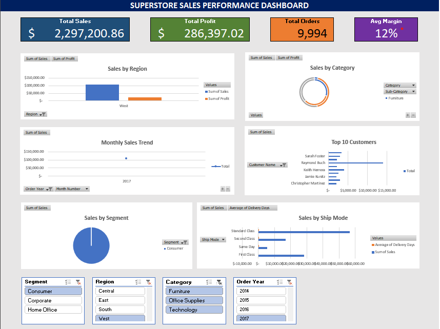

# 📊 Superstore Sales Performance Dashboard

## 📌 Project Overview
Analyzed 9,000+ rows of retail sales data to uncover trends
in revenue, product performance, and regional sales distribution.
Built an interactive Excel dashboard for stakeholder reporting.

## 🛠️ Tools Used
- **Microsoft Excel** — Pivot Tables, Charts, Slicers, Dashboard Design
- **Power Query** — Data Cleaning, Transformation, Calculated Columns

## 📂 Dataset
- **Source:** [Kaggle - Superstore Sales](https://www.kaggle.com/datasets/vivek468/superstore-dataset-final)
- **Size:** 9,994 rows × 21 columns

## 🔍 Data Cleaning Process (Power Query)
1. Removed duplicate records
2. Fixed date format inconsistencies using Locale settings
3. Trimmed extra spaces from all text columns
4. Added 6 calculated columns:
   - Order Year, Order Month, Month Number
   - Delivery Days, Profit Margin %, Revenue Category

## 📊 Dashboard Preview

## 💡 Key Insights
- 🏆 West region generates 32% of total revenue
- 📈 Technology category has the highest profit margin
- 👥 Top 10 customers contribute 15% of total profit
- 📅 November & December are peak sales months
- 🚚 Same Day shipping is fastest but least used

## 📬 Contact
- **LinkedIn:** Raymond Palang(https://linkedin.com/in/monrealm)
- **Email:** raymondpalang0@gmail.com
